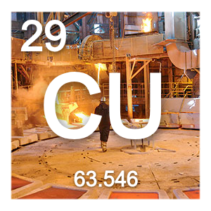

# Copper

## About

Copper is a featured components collection also HTTP/WebSockets base project.

## License

Copper is released under the GNU Affero General Public License v3.0 (AGPLv3),  
a free software license that guarantees end users access to the source code,  
even when used over a network.

> See the [LICENSE](./LICENSE) file for the full legal text.